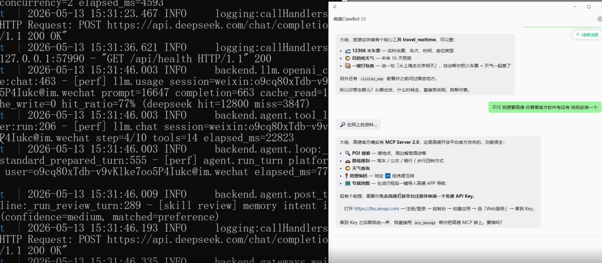

# LZAgent (栗子Agent)

面向个人日常使用的 IM 优先 AI 助理平台。



📺 **项目演示视频**：[bilibili.com/video/BV1bc5S6dEq6](https://www.bilibili.com/video/BV1bc5S6dEq6/)

项目基于 `FastAPI`、`PostgreSQL + pgvector`、`Neo4j`、`Redis`、`MCP` 和 OpenAI 兼容大模型构建。系统采用 **先识别意图与技能，再注入记忆与知识，再调用工具执行，最后沉淀技能、偏好与知识图谱** 的流程，可在微信 / 飞书等 IM 场景下完成论文查询、旅游规划、日报订阅、定时任务、知识沉淀、图谱抽取等日常任务。


---

## 核心特性

- **IM 优先**：通过微信/飞书等 IM 平台直接对话，无需 Web UI
- **长期记忆**：自动记住用户偏好、习惯、关系，跨会话持久化
- **知识图谱**：从对话和文档中自动抽取结构化知识，写入 Neo4j
- **技能系统**：可复用的 SKILL.md 工作流，支持自动沉淀和审查
- **MCP 扩展**：通过 MCP 协议安装第三方工具，一键扩展能力
- **定时任务**：支持 cron 表达式，定时推送论文/新闻/天气
- **多用户支持**：每用户独立记忆空间，支持角色权限管理
- **多模态**：支持图片识别、PDF/文件内容提取
- **可观测性**：内置工具调用追踪、健康评分、实时仪表盘

---

## 快速开始

### 1. 克隆项目

```bash
git clone https://github.com/your-username/LZAgent.git
cd LZAgent
```

### 2. 配置环境变量

```bash
cp .env.example .env
```

编辑 `.env`，至少配置 LLM：

```env
OPENAI_API_KEY=your-api-key
OPENAI_BASE_URL=https://api.deepseek.com/v1
OPENAI_MODEL=deepseek-chat
```

### 3. Docker 一键启动

```bash
docker compose up -d --build
```

启动四个服务：
- **LZAgent**：http://localhost:8020
- **PostgreSQL + pgvector**：localhost:5432
- **Neo4j**：http://localhost:7474
- **Redis**：localhost:6379

### 4. 验证

```bash
curl http://localhost:8020/api/health
# {"status":"ok","app":"LZAgent","version":"1.0.0"}
```

---

## 接入 IM

### 微信（个人号）

```bash
docker compose run --rm weixin-login
```

扫码后即可在微信中与 LZAgent 对话。

### 飞书

1. 在 [飞书开放平台](https://open.feishu.cn/app) 创建应用
2. 启用机器人能力，添加权限：`im:message`、`im:message.create`、`im:resource`
3. 在 `.env` 中配置：

```env
FEISHU_APP_ID=cli_xxxx
FEISHU_APP_SECRET=xxxx
```

4. 重启服务：`docker compose restart lzagent`

飞书使用 WebSocket 长连接模式，无需公网 IP。

---

## 使用示例

### 论文搜索

```
帮我找几篇关于 transformer 的最新论文
```

系统自动调用 Google Scholar / arxiv / Semantic Scholar 搜索，返回结构化结果。

### 旅行规划

```
帮我规划下周五去成都三天的行程，预算 3000
```

进入旅行领域包：行程编排 → 12306 实时余票 → 路线优化。

### 记住偏好

```
我以后默认坐高铁不坐飞机
```

自动写入长期记忆，下次规划行程时自动套用。

### 安装新工具

```
我需要一个查实时航班的工具
```

自动搜索 MCP 注册表，用户确认后一键安装。

### 定时任务

```
每天早上 8 点把昨晚的 arxiv AI 论文整理推给我
```

创建 cron 任务，到点自动执行并推送结果。

### 知识沉淀

```
记一下：项目 X 的截止日是 6 月 30 日
```

写入知识库 → 异步抽取图谱 → 可视化查询。

### 会话管理

```
/new          # 重置会话
/summary      # 查看会话摘要
/export       # 导出对话记录
```

---

## 设计哲学：分层抽象

参考计算机网络的分层模型，按"用户能否参与"把系统切成三层：

```
        ┌──────────────────────────────────────────┐
        │   外壳层（IM 对话 / Docker 部署）         │  ← 用户在这一层
        │  ┌────────────────────────────────────┐  │
        │  │   工具层（Tools / MCP，可插拔）      │  │  ← 用户能装、能开关
        │  │  ┌──────────────────────────────┐  │  │
        │  │  │   核心层（Agent / Memory /     │  │  │  ← 用户从不需要碰
        │  │  │   Skills / GraphRAG / Wiki）  │  │  │
        │  │  └──────────────────────────────┘  │  │
        │  └────────────────────────────────────┘  │
        └──────────────────────────────────────────┘
```

---

## 核心数据流

```
用户消息（微信/飞书/Webhook）
        ↓
Intent Detector + Router LLM
识别意图，选定候选 Skill / Knowledge Mode
        ↓
Memory Injection
读 PostgreSQL 长期记忆，注入 system prompt
        ↓
Skill Loader
按需加载磁盘上的 SKILL.md
        ↓
Agent Loop（LLM + Tools）
调用内置工具或 MCP 工具，三级权限（safe / confirm / deny）
        ↓
Wiki Answer Cache → Knowledge Mode Wiki → GraphRAG Snapshot
答案 / 文档 / 图谱三层复用
        ↓
Background Review Fork + Graph Extraction
异步沉淀技能、写长期记忆、抽取知识图谱
```

---

## 内置工具（15 个）

| 工具 | 权限 | 说明 |
|---|---|---|
| `web_search` | safe | 网页搜索（DuckDuckGo/Bing/SearXNG） |
| `scholar_search` | safe | Google Scholar 学术搜索 |
| `read_url` | safe | 读取网页内容 |
| `read_file` | safe | 读取 workspace 文件 |
| `write_file` | confirm | 写文件（需确认） |
| `file_extract` | safe | 提取 PDF/文件内容 |
| `memory_manage` | safe | 长期记忆管理 |
| `skill_manage` | safe | 技能管理 |
| `cron_manage` | confirm | 定时任务管理 |
| `mcp_manage` | confirm | MCP 工具管理 |
| `knowledge_ingest` | confirm | 知识沉淀 |
| `knowledge_inspect` | safe | 知识库查询 |
| `code_execution` | confirm | 代码执行（沙箱） |
| `send_message` | confirm | 主动发消息 |
| `delegate` | safe | 委派子 agent |
| `tool_search` | safe | 搜索可用工具 |

---

## API 概览

| 端点 | 说明 |
|---|---|
| `GET /api/health` | 健康检查 |
| `GET /api/doctor` | 八组件自检 |
| `GET /api/harness/health` | 可观测性健康评分 |
| `GET /api/harness/dashboard` | 实时仪表盘 |
| `GET /api/memory` | 记忆列表 |
| `GET /api/skills` | 技能列表 |
| `GET /api/users` | 用户列表 |
| `GET /api/sessions` | 会话列表 |
| `GET /api/plugins` | 插件列表 |
| `GET /api/tools` | 工具列表 |
| `GET /api/graph-rag` | 知识图谱总览 |
| `GET /api/knowledge-bases` | 知识库列表 |

---

## 记忆系统

参考 Hermes Agent 的长期记忆生命周期：

| 模块 | 职责 |
|---|---|
| `store.py` | PostgreSQL 持久化，200 条上限，LRU 驱逐 |
| `manager.py` | 组装 `<memory-context>` 围栏注入 system prompt |
| `retrieval.py` | 时间衰减 + 访问频率 + 子串匹配加权召回 |
| `scanner.py` | 12 条威胁正则防 prompt injection |
| `intent.py` | 中文 durable instruction 触发器 |

三层语义：
- **L1 control_axiom**：控制论底座（系统管理，只读）
- **L2 agent_note**：抽象底层逻辑（agent 自己的笔记）
- **L3 user_fact**：用户事实（偏好、关系、习惯）

---

## 知识图谱（GraphRAG）

| Schema | 节点类型 | 触发来源 |
|---|---|---|
| `paper` | Paper / Keyword / Author / Venue | wiki 输出页 |
| `memory` | Memory / Topic / Preference / Entity | UserMemory 行 |

- LLM 抽取 → JSON 缓存 → Neo4j 持久化
- 异步管线，用户发消息时只读缓存
- 夜间全量重建

---

## 技能系统

技能文件位于 `workspace/skills/<name>/SKILL.md`，支持：

- YAML frontmatter 定义 triggers、capabilities
- Markdown body 作为 prompt 内容
- 热加载，无需重启
- 自动审查和归档（curator）

---

## MCP 扩展

通过 MCP 协议安装第三方工具：

```bash
# 在 IM 中说：我需要一个查股票的工具
# 系统自动搜索 → 用户确认 → 一键安装
```

支持 5 种包管理器：npm / pip / uvx / git_npm / git_pip

---

## 配置项

所有配置通过环境变量（前缀 `LZAGENT_`）或 `.env` 文件设置。

| 变量 | 默认值 | 说明 |
|---|---|---|
| `OPENAI_API_KEY` | - | LLM API Key |
| `OPENAI_BASE_URL` | - | LLM API 地址 |
| `OPENAI_MODEL` | - | 模型名称 |
| `LZAGENT_HOST` | `0.0.0.0` | 监听地址 |
| `LZAGENT_PORT` | `8020` | 监听端口 |
| `LZAGENT_LOG_LEVEL` | `INFO` | 日志级别 |
| `LZAGENT_MEMORY_MAX_ENTRIES` | `200` | 最大记忆条数 |
| `LZAGENT_MCP_ENABLED` | `true` | 启用 MCP |
| `LZAGENT_GRAPH_LLM_ENABLED` | `true` | 启用知识图谱 |
| `FEISHU_APP_ID` | - | 飞书应用 ID |
| `FEISHU_APP_SECRET` | - | 飞书应用 Secret |
| `SERPAPI_API_KEY` | - | SerpAPI Key（Google Scholar） |
| `LZAGENT_SCHOLAR_PROXY` | - | Google Scholar 代理 |

完整配置见 `backend/core/config.py`。

---

## 项目结构

```
LZAgent/
├── backend/
│   ├── app.py                FastAPI 入口
│   ├── agent/                AgentLoop / 路由 / 护栏 / 失败学习
│   ├── api/                  HTTP 路由
│   ├── gateways/             IM 适配（微信/飞书/Webhook）
│   ├── memory/               记忆子系统
│   ├── skills/               技能子系统
│   ├── tools/                工具子系统
│   ├── mcp/                  MCP 子系统
│   ├── graph/                知识图谱
│   ├── wiki/                 答案缓存
│   ├── cron/                 定时任务
│   ├── domains/travel/       旅行领域包
│   ├── harness/              控制面（可观测性）
│   ├── llm/                  LLM 客户端
│   ├── db/                   数据库模型
│   └── core/                 配置
├── workspace/
│   ├── skills/               技能文件（SKILL.md）
│   ├── knowledge_modes/      知识模式
│   ├── memory/               记忆持久化
│   └── sessions/             会话导出
├── config/                   配置文件（mcp_servers.yaml）
├── scripts/                  验证脚本
├── Dockerfile
├── docker-compose.yml
├── requirements.txt
└── .env.example
```

---

## 技术栈

| 类型 | 技术 |
|---|---|
| Web 服务 | FastAPI + Uvicorn |
| Agent 编排 | 自研 AgentLoop + ContextEngine + ToolRegistry |
| LLM | OpenAI 兼容（DeepSeek / Qwen / OpenAI） |
| 关系数据库 | PostgreSQL 16 + pgvector |
| 图数据库 | Neo4j 5 Community |
| 缓存 / Session | Redis 7 |
| 工具协议 | MCP（stdio + streamable-http） |
| 长期记忆 | PostgreSQL + JSONL 会话归档 |
| 知识库 | Markdown + LLM GraphRAG |
| 飞书接入 | lark-oapi SDK（WebSocket 长连接） |
| 微信接入 | iLink Bot 协议（轮询） |

---

## 验证

```bash
# 编译检查
docker compose exec lzagent python -m compileall -q backend scripts

# GraphRAG 验证
docker compose exec lzagent python scripts/smoke_llm_graph.py

# MCP 端到端
docker compose exec lzagent python scripts/mcp_e2e_check.py

# 离线 demo
docker compose exec lzagent python scripts/demo_e2e.py
```

---

## 适用场景

**适合**：
- 个人 IM 日常助理
- 论文/旅行/天气/记忆/定时任务等高频对话
- 需要长期记忆、技能沉淀、MCP 工具扩展的助理系统
- 需要在微信/飞书里直接完成自然语言交互的场景

**不适合**：
- 强实时交易系统或高频低延迟业务核心
- 必须强事务一致性的在线业务主系统
- 超大规模多人协作知识库的完整替代品

---

## License

MIT License

---

## 致谢

- [Hermes Agent](https://github.com/NousResearch/hermes-agent) — 记忆系统、工具护栏设计参考
- [OpenClaw](https://github.com/steipete/openclaw) — 工具权限模型、MCP 安全管线参考
- [llm-wiki](https://github.com/nvk/llm-wiki) — 知识沉淀机制参考
- [andrej-karpathy-skills](https://github.com/forrestchang/andrej-karpathy-skills) — 编程原则参考
